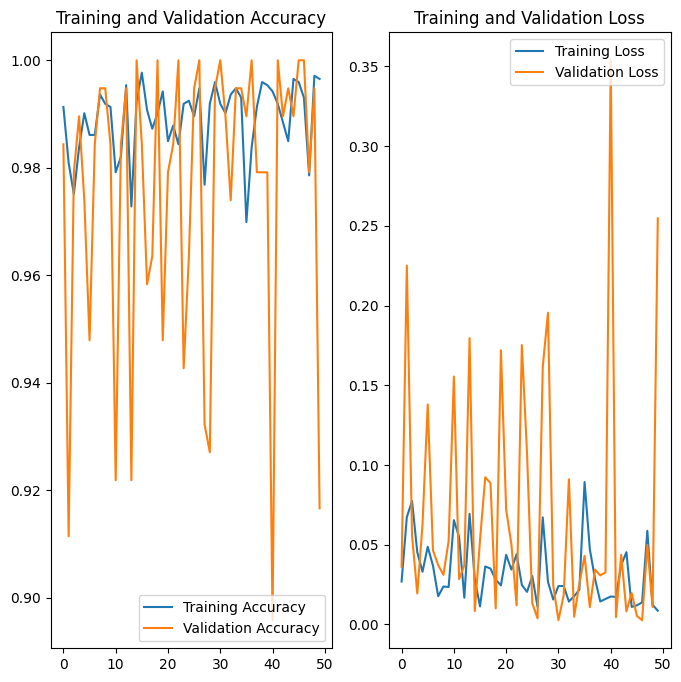
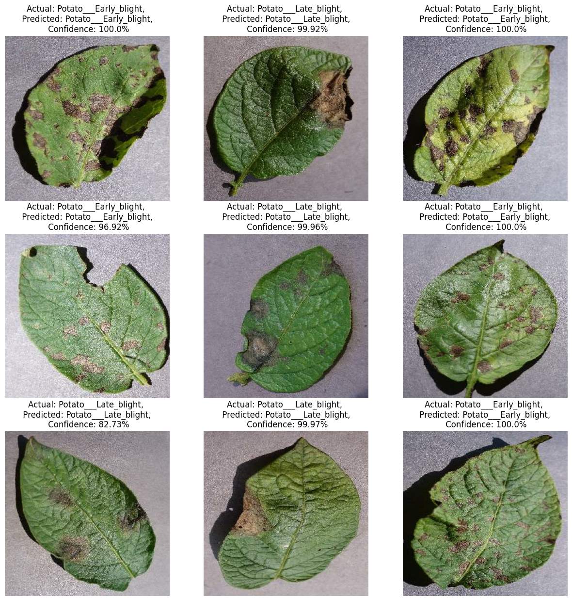

# Crop Disease Detection Using Convolutional Neural Networks

This project implements a deep learning–based image classification system to identify diseases in potato plant leaves using Convolutional Neural Networks (CNNs). The model is trained using TensorFlow and Keras on images from the PlantVillage dataset and classifies leaves into healthy and diseased categories.

---

## Problem Statement
Early detection of plant diseases is crucial for improving crop yield and reducing agricultural losses. Manual inspection is time-consuming and prone to errors. This project explores the use of deep learning to automatically classify potato leaf diseases from images.

---

## Dataset
- **Dataset Name:** PlantVillage  
- **Classes:**
  - Potato___Early_blight
  - Potato___Late_blight
  - Potato___healthy
- **Total Images:** 2152  
- **Image Size:** 256 × 256  

**Note:** The dataset is not included in this repository due to size constraints.  
You can download it from Kaggle:  
https://www.kaggle.com/datasets/emmarex/plantdisease

Place the dataset inside a folder named `PlantVillage/` before training.

---

## Model Architecture
The CNN model consists of:
- Image resizing and normalization
- Data augmentation (random flips and rotations)
- 6 convolutional layers with ReLU activation
- Max-pooling layers for spatial downsampling
- Fully connected dense layers
- Softmax output layer for multi-class classification

---

## Training Details
- **Framework:** TensorFlow / Keras  
- **Optimizer:** Adam  
- **Loss Function:** Sparse Categorical Crossentropy  
- **Batch Size:** 32  
- **Epochs:** 50  
- **Train / Validation / Test Split:** 80% / 10% / 10%

---

## Results
- **Training Accuracy:** ~99%  
- **Validation Accuracy:** Up to 100%  
- **Test Accuracy:** **94.5%**

The model demonstrates strong generalization performance on unseen test data.

---

## Sample Predictions
The trained model correctly predicts potato leaf diseases with high confidence, as demonstrated through test set visualizations.

---
